# Ray v2 Architecture

## 一、Overview

### 1.1 API philosophy

* Ray 旨在为分布式计算提供一个通用的 API，实现这一目标的核心部份是**提供简单但通用的编程抽象**，让系统完成所有困难的工作。这种理念使得开发人员可以将 Ray 与现有的 Python 库和系统一起使用。
* Ray 程序员使用少量 Python 原语表达他们的逻辑，而系统管理 physical execution concerns，例如并行性和分布式内存管理。Ray 用户**从资源的角度**思考集群管理，系统根据这些资源请求来**管理调度和自动缩放。**
* *Ray provides a universal API of **tasks**, **actors**, and **objects** for building distributed applications.*
* Ray‘s API 的第二个目标：允许应用程序对系统行为进行**细粒度控制**。这是通过一组可用于修改系统行为的**可配置参数**来实现的，比如 [task placement](https://docs.google.com/document/d/1tBw9A4j62ruI5omIJbMxly-la5w4q_TjyJgJL_jN2fI/preview#heading=h.wqf2cgg6f66n), [fault handling](https://docs.google.com/document/d/1tBw9A4j62ruI5omIJbMxly-la5w4q_TjyJgJL_jN2fI/preview#heading=h.tlm9n2vnrd30), and [application lifetime](https://docs.ray.io/en/master/advanced.html#detached-actors).

### 1.2 System scope

* easily compose multiple libraries
* an excellent “**distributed glue**” system
* 因为 Ray 的 API 是通用的，并且性能足以充当许多不同工作负载类型之间的接口。

### 1.3 System design goals

* 驱动 Ray 架构的核心原则：**API simplicity** 和 **generality**
* core system goals：**performance** (low overhead and horizontal scalability) 和 **reliability**
  * for performance：Ray is built on top of gRPC
  * for reliability：# distributed reference counting protocol # various options to **recover** from failures.
* trade-off，增加了架构复杂性
  * 比如，Ray 的组件 distributed reference counting 和 distributed memory，增加了架构复杂性，但提升了 performance 和 reliability
* seamless scaling，with low overhead
  * 用资源而不是机器来表达计算
  *  [distributed scheduler](https://docs.google.com/document/d/1tBw9A4j62ruI5omIJbMxly-la5w4q_TjyJgJL_jN2fI/preview#heading=h.59ui0zg51ggk) and [object manager](https://docs.google.com/document/d/1tBw9A4j62ruI5omIJbMxly-la5w4q_TjyJgJL_jN2fI/preview#heading=h.rnw6v42ykv7t) 

### 1.4 Related systems

* **Cluster Orchestrators**
* **Parallelization Frameworks**
* **Data Processing Frameworks**
* **Actor Frameworks**
* **HPC Systems**

### 1.5 New in 2.0 whitepaper

## 二、Architecture Overview

### 2.1 Application concepts

* Task：   # A remote function invocation # stateless or stateful # asynchronously # returns ObjectRefs
* Object：# returned by a task or created through `ray.put ` # immutable
* Actor：  # A stateful worker process
* Driver：# The program root
* Job：     # The collection of tasks，objects，and actores from the same driver

### 2.2 Design

#### 2.2.1 Components

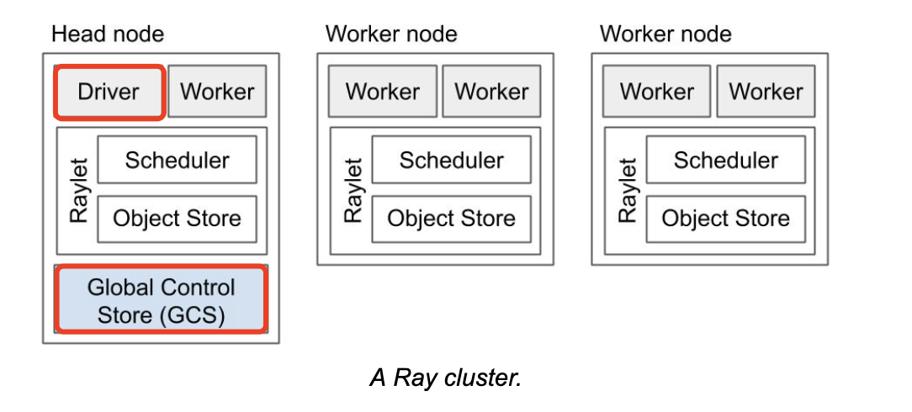

* **worker processes**
  * 负责任务的提交和执行
  * 每个worker process 关联一个 job
  * initial workers 的默认数量等于机器上的CPU个数
  * 每个 worker 存储
    * ownership table：system metadata for the objects to which the worker has a reference, e.g., to store ref counts and object locations.
    * in-process store：store small objects.
* **raylet**
  * 管理每个节点上的共享资源。与 worker processes 不同的是，raylet 在所有并发运行的 jobs 共享
  * 有两个主要的组件，运行在在独立的线程上
    * scheduler：responsible for resource management，task placement，and fulfilling task arguments that are stored in the distributed object store.
    * shared-memory object store：responsible for storing, transferring, and spilling large objects.

---

* **GCS**
  * manages cluster-level metadata, such as the locations of actors
  * manages a handful of cluster-level operations, including scheduling for placement groups and actors and determining cluster node membership.
  * fault tolerance
* **Driver process**
  * executes the top-level application(e.g., `__main__` in Python)
  * can submit tasks but cannot execute any itself.
* **cluster-level services**
  * handle job submission, autoscaling, etc. 

#### 2.2.2 Ownership

大多数系统元数据是根据称为 ownership 的去中心化概念进行管理的。这个概念意味着应用程序中的每个 ObjectRef 都将由单个 worker process 管理。

ownership 的优点：

1. Low task latency
2. High throughput
3. Simplified architecture
4. Improved reliability

ownership 的缺点：

1. object 跟它的 owner 共命运
2. ownership 无法转让

#### 2.2.3 Memory model

Ray 可以通过以下方式使用内存

1. Heap memory used by Ray workers during task or actor execution. 
2. Shared memory used by large Ray objects 
3. Heap memory used by small Ray objects 
4. Heap memory used by Ray metadata. 

#### 2.2.4 Language Runtime

* All Ray core components are implemented in C++
* Core Worker library
  * Ownership table
  * In-process store
  * manages gRPC communication with other workers and raylets

### 2.3 Lifetime of a Task

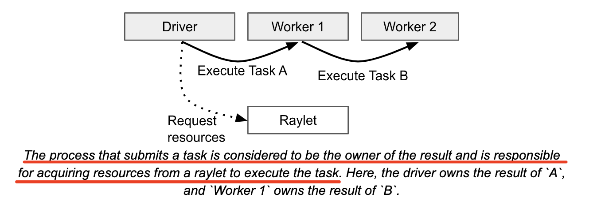

### 2.4 Lifetime of an Object

* The owner of an object is the worker that created the initial ObjectRef, by submitting the creating task or calling ray.put
* The owner manages the lifetime of the object.

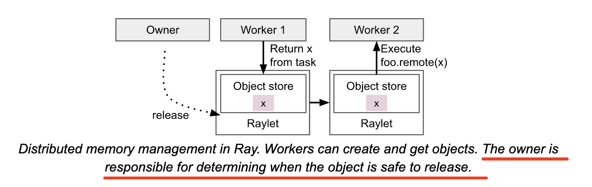

### 2.5 Lifetime of an Actor

* Actor lifetime and metadata are managed by the GCS

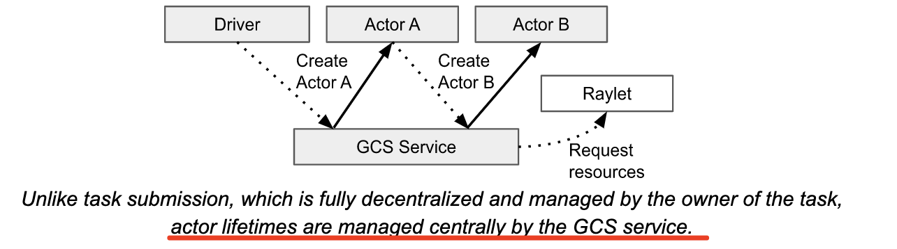

### 2.6 Failure Model

#### 2.6.1 System Model

#### 2.6.1 Application Model

## 三、Object Management

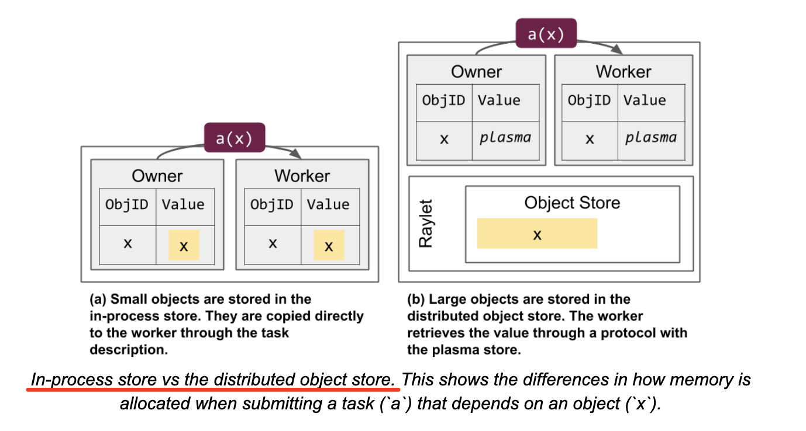

### 3.1 Object resolution

* Resolution：convert `ObjectRef` to the underlying physical value, when calling ray.get or passing as a task arguments.
* ObjectRef comprises two fields:
  * ID
  * The address of the object's owner(a worker process)

* Small objects are resolved by copying them directly from the owner's in-process store.
* Large objects are stored in the distributed object store and must be resolved with a distributed protocol.
  * object in local shared memory store: can retrieve the object over IPC.
  * object not in local shared memory store: notifies its local raylet, wich then attemps to fetch a copy from a remote raylet.

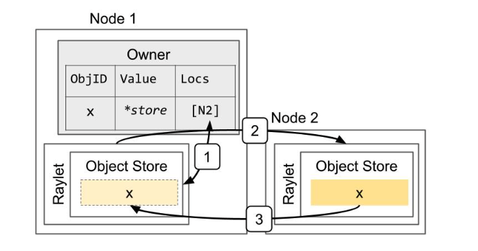

*Resolving a large object. The object x is initially created on Node 2, e.g., because the task that returned the value ran on that node. This shows the steps when the owner (the caller of the task) calls `ray.get`: 1) Lookup object’s locations at the owner. 2) Select a location and send a request for a copy of the object. 3) Receive the object.*

### 3.2 Memory management

* Primary copy: 主副本是唯一的，只要在作用域内有引用，它就不会被驱逐。
* evictable copies：如果本地内存有压力，其他副本可能会被LRU驱逐。
* garbage-collected：一旦 object 的引用计数变为0，object 的所有副本最终都会自动被垃圾回收。
  * small objects：owner 会立即从 in-process store 删除对象
  * large objects：raylets 会异步地从 distributed object store 删除对象

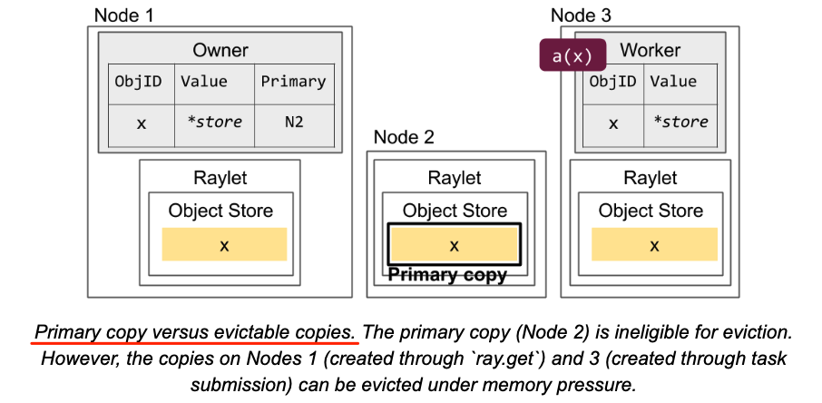

Raylets 还负责管理 distributed object transfer，

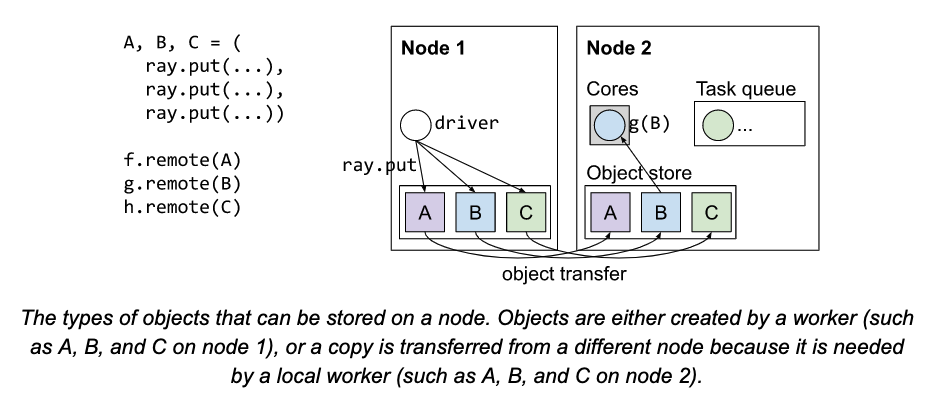

#### 3.2.1 Handling out-of-memory cases

* 对于 small objects，Ray 目前没有对每个 worker's in-process store 施加内存限制。因此，作用域内过多的 small objects 可能会导致 owner process 由于内存不足被杀掉。
* Ray 对共享内存对象施加了硬性限制，raylet 负责强制执行此限制。

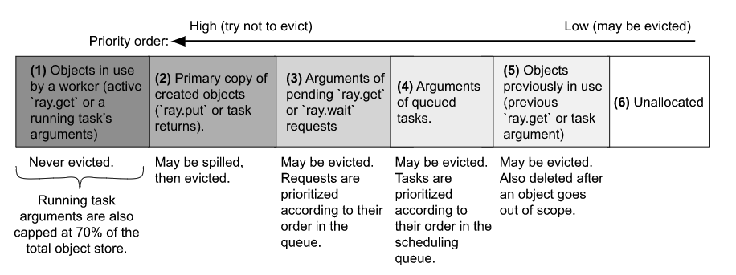

* object 创建请求由 raylet 排队，当有足够的可用内存时创建对象 (6)
*  如果需要更多内存，raylet 将选择对象从(3)-(5)中驱逐以腾出空间。
* 如果驱逐对象后内存还是不够，raylet 首先在整个集群中的每个worker上触发特定语言的垃圾回收
* Spilling can be expensive and add long delays to task execution.

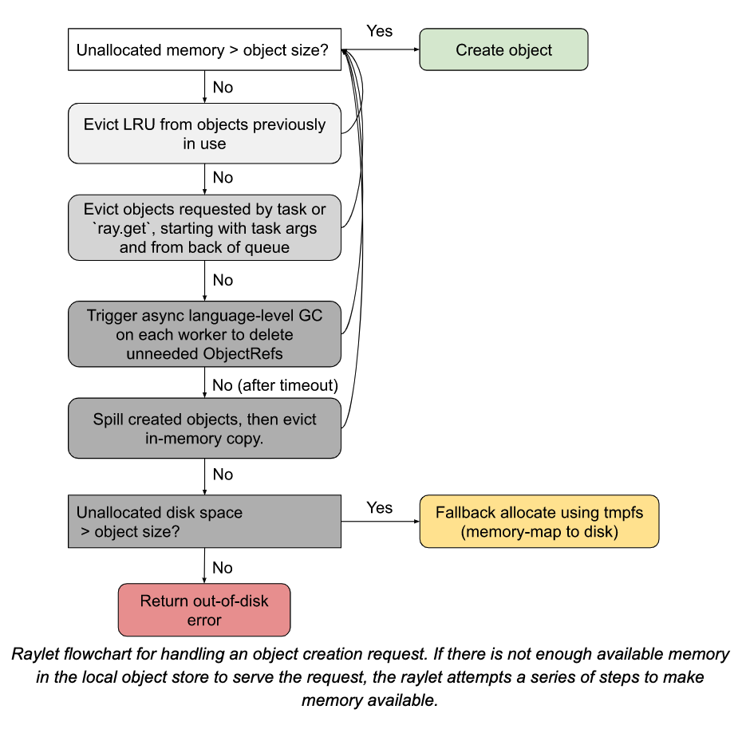

#### 3.2.2 Object spilling

* Ray only spills the primary copy of an object: this is the initial copy of the object, created by executing a task or through ray.put
* Primary copies are only evictable after object spilling, or if there are no more references in the application.

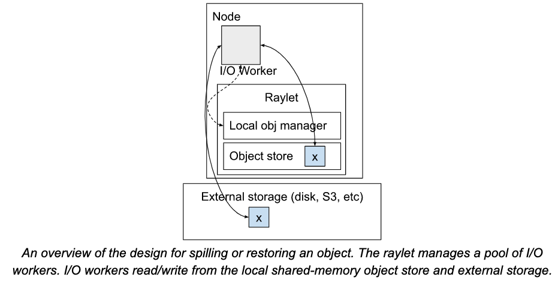

### 3.3 Reference Counting

* Each worker stores a ref count for each object that it owns.
* The owner's local ref count includes:
  * the local Python ref count
    * decremented when a Python ObjectRef is deallocated.
  * the number of pending tasks submitted by the owner that depend on the object.
    * decremented when a task that depends on the object successfully finishes
* ObjectRef can also be copied to another process by storing them inside another object.
  * **Borrower**: The process that receives the copy of the ObjectRef is known as a borrower.

#### 3.3.1 Corner cases

* References that are captured in a remote function or class definition will be pinned permanently. 
* 

#### 3.3.2 Actor handles

#### 3.3.3 Interaction with Python GC

### 3.4 Object Failure

#### 3.4.1 Small Objects

#### 3.4.2 Large objects and lineage reconstruction

## 四、Task Management

### 4.1 Task execution

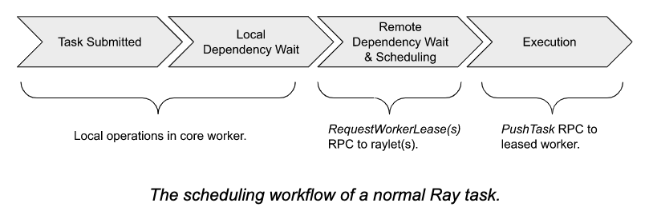

#### 4.1.1 Dependency resolution

* The task caller waits for all task arguments to be created **before requesting resources from the distributed scheduler.** In many cases, the caller of a task is also the owner of the task arguments.
  * `foo.remote(bar.remote())` : the caller owns both tasks and will not schedule `foo` until `bar` has completed. This can be executed locally because the caller will store the result of `bar` in its in-process store

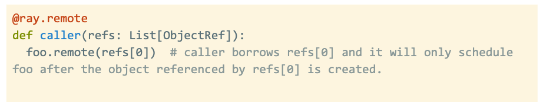

Tasks can have three types of arguments:

1. Plain values: `f.remote(2)`
2. inlined object: `f.remote(small_obj_ref)`
3. Non-inlined object: `f.remote(large_or_pending_obj_ref)`

#### 4.1.2 Resource fulfillment

1. By **data locality**: chooses the node that has the most number of object argument bytes already local.
2. By **node affinity**: NodeAffinitySchedulingStrategy.
3. By **default**, the local raylet.

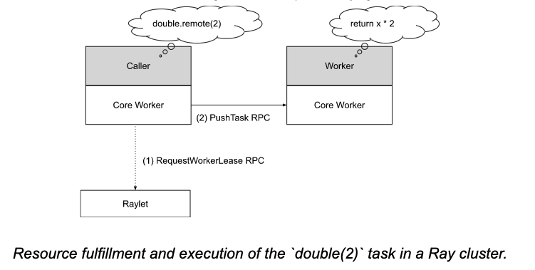

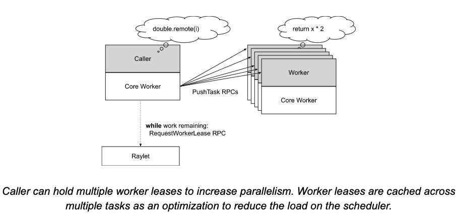

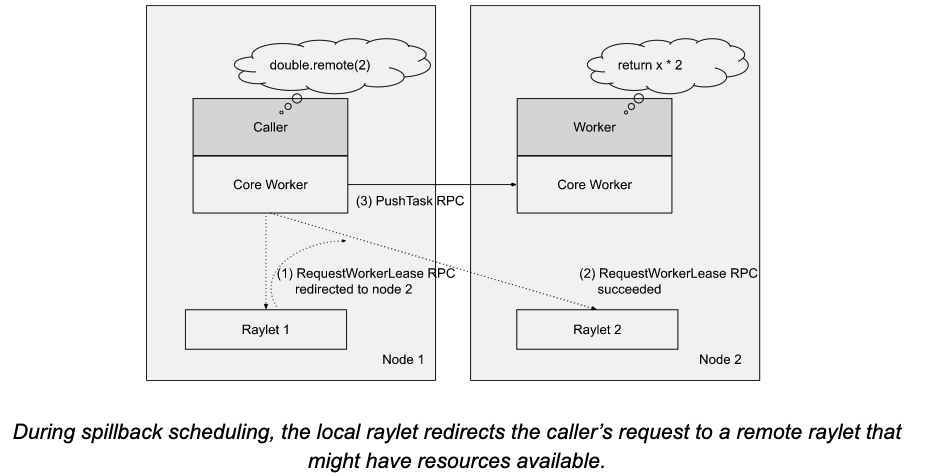

## 五、Resource Management and Scheduling

* Ray scheduler has naive support for CPU、GPU and memory resource types
* Ray resources are **logical** and don‘t need to have 1-to-1 mapping with physical resources
* **The purpose of the distributed scheduler** is to match resource requests from the callers to resource availability in the cluster.
  * Resource requests are **hard scheduling constraints**. 
  * Each `@ray.remote` function requires 1 CPU for execution ({“CPU”: 1}) by default. 
  * An actor, i.e. a `@ray.remote` class, will request 0 CPU for execution by default. 
  * This is so that a single node can host more actors than it has cores, leaving CPU multiplexing to the OS. 
  * Actors also request 1 CPUs for *placement*, meaning that the chosen node must have at least 1 CPU in its total resources. This is to enable applications to prevent actors from being scheduled to particular nodes, i.e. by starting the node with `--num-cpus=0`.

### 5.1 Distributed scheduler

#### 5.1.1 Resource accounting

* Each raylet tracks the resources local to its node.
  * the raylet always has a strongly consistent view of the local resource availability.
* Each raylet also receives information from the [GCS](https://docs.google.com/document/d/1tBw9A4j62ruI5omIJbMxly-la5w4q_TjyJgJL_jN2fI/preview#heading=h.spc81kx34qyt) about resource availability on other nodes in the cluster. 
  * This is used for distributed scheduling, e.g., to load-balance across nodes in the cluster. 
  * To reduce overheads of collection and dissemination, this information is only eventually consistent; it may be stale.
  *  The information is sent through a **periodic broadcast**. GCS pulls resource availability from each raylet periodically (100ms by default) and then aggregates and rebroadcasts them back to each raylet. 

#### 5.1.2 Scheduling state machine

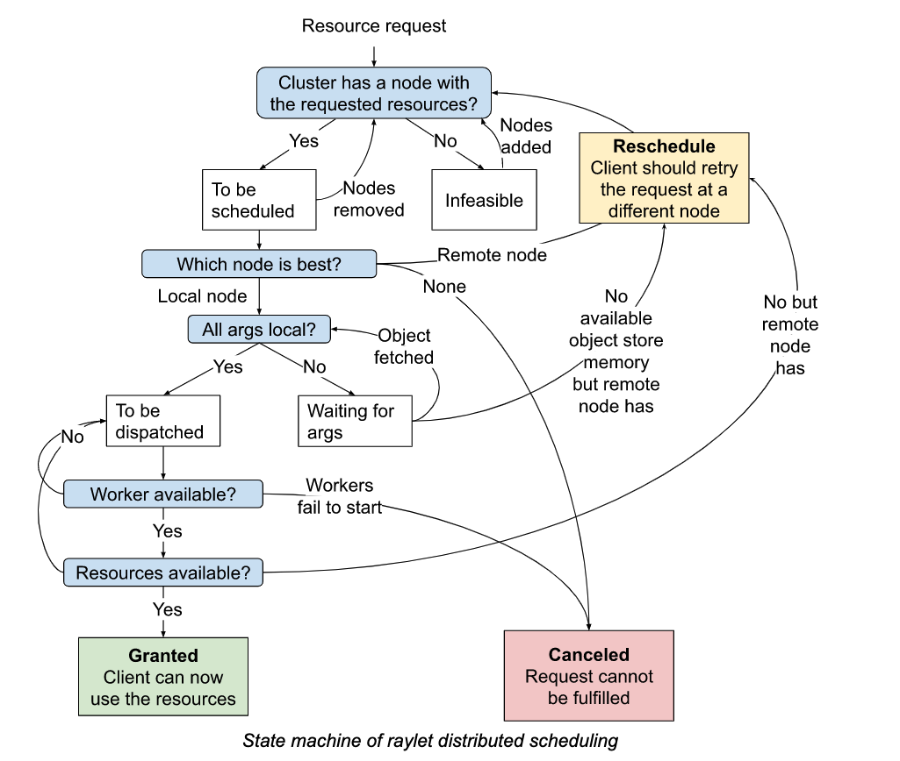

When a resource request (i.e RequestWorkerLease PRC) is received by the raylet, it will go through the above state machine and end with one of the three states:

* **Granted**: The client may now use the granted resources and worker to execute a task or actor.
* **Reschedule**: There was a better node than the current one, according to the current node’s view of the cluster. The client should reschedule the request. There are two possibilities:
  * If the current node is the client’s preferred raylet (i.e. the first raylet that the client contacted), then this is a [*spillback request*](https://docs.google.com/document/d/1tBw9A4j62ruI5omIJbMxly-la5w4q_TjyJgJL_jN2fI/preview#heading=h.675q3tqxg0i7)*.* The client should retry the request at the raylet specified by the first raylet.
  * Else, the current node was the one chosen by the client’s preferred raylet. The client should retry the request at the preferred raylet again.
* **Canceled:** The resource request could not be run. This can happen if the requested scheduling policy is not feasible. For example:
  * The client requested a [hard node affinity policy](https://docs.google.com/document/d/1tBw9A4j62ruI5omIJbMxly-la5w4q_TjyJgJL_jN2fI/preview#heading=h.7ivxtwdh0yym) but the node is dead.
  * The requested runtime env for a task failed to be created, so the raylet could not start workers to fulfill the request.

The actual logic of deciding “Which node is best” to fulfill the request is controlled by the [scheduling policies](https://docs.google.com/document/d/1tBw9A4j62ruI5omIJbMxly-la5w4q_TjyJgJL_jN2fI/preview#heading=h.wqf2cgg6f66n), described below.

#### 5.1.3 Scheduling policies

Ray has several scheduling policies that **control where to run the task or actor.** When a task or actor is submitted, the user can optionally specify a scheduling strategy/policy to use (e.g. `task.options(scheduling_strategy=MySchedulingPolicy).remote()`).

##### 5.1.3.1 Default Hybrid Policy

* default policy 
*  This policy first tries to pack tasks onto the local node until the node’s *critical resource utilization* exceeds a configured threshold (**50% by default**). 
* After the threshold is exceeded on the local node, the policy packs tasks onto **the first remote node** (sorted by the node id), then the second remote node and so on and so forth until the critical resource utilization on all nodes exceeds the threshold. After that it will pick the node with **the least critical resource utilization**.
* The purpose of this policy is to **achieve a medium between bin-packing and load-balancing**. When nodes are under the critical resource utilization, the policy favors bin-packing. Sorting by node ID ensures that all nodes use **the same order** when bin-packing. When nodes are over the critical resource utilization, the policy favors **load-balancing**, picking the least-loaded node.

##### 5.1.3.2 Spread Policy

This policy spreads tasks among nodes with available resources using **round-robin**. Note that the round-robin order is local to each node’s distributed scheduler; there is no global round-robin. If no node has available resources, tasks are spread round-robin among feasible nodes.

##### 5.1.3.3 Node Affinity Policy

With this policy, a user can explicitly **specify a target node** where the task or actor should run. If the target node is alive, the task or actor only runs there. If the target node is dead, then **depending on whether the affinity is soft or not**, the task or actor may be scheduled to other nodes or fail to be scheduled.

##### 5.1.3.4 Data Locality Policy

Ray supports **data locality** by having each task caller choose a preferred raylet based on the caller’s local information about **task argument locations.** The scheduling policies implemented by the raylets do not consider data locality. This is to avoid adding extra RPCs and complexity to raylets to discover which task arguments are stored on which other nodes.

##### 5.1.3.5 Placement Group Policy

This policy runs the task or actor where the given [placement group](https://docs.google.com/document/d/1tBw9A4j62ruI5omIJbMxly-la5w4q_TjyJgJL_jN2fI/preview#heading=h.96g6ky77y4f6) is located.

### 5.2 Placement Groups

Since 1.0, Ray supports [Placement Groups](https://docs.ray.io/en/master/placement-group.html). Placement groups allow users to **atomically reserve groups of resources across multiple nodes** (i.e., for **==gang scheduling==**). 

* Each placement group consists of ***resource bundles*,** i.e. {CPU: 2}. 
* Bundles in the group can be packed as close as possible for locality (PACK), or spread apart (SPREAD). 
* Groups can be destroyed to release all resources associated with the group. The Ray Autoscaler is aware of placement groups, and auto-scales the cluster to ensure pending groups can be placed as needed.

#### 5.2.1 Placement Group Creation

When the application requests a placement group creation, the worker sends a **synchronous RPC** to the [GCS](https://docs.google.com/document/d/1tBw9A4j62ruI5omIJbMxly-la5w4q_TjyJgJL_jN2fI/preview#heading=h.pbfdfypjcdk4). The GCS flushes the creation request to its backing storage and queues the creation request.

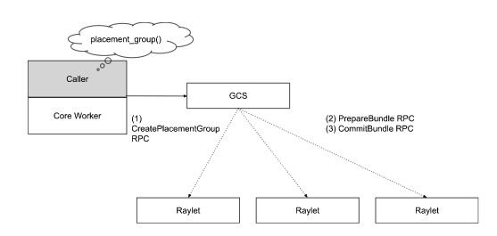

Since resource groups may involve resources across multiple nodes, Ray uses a [two phase commit protocol](https://en.wikipedia.org/wiki/Two-phase_commit_protocol) across the raylets to ensure atomicity. The protocol is coordinated by the GCS. If any raylet dies in the middle of the protocol, the placement group creation is rolled back and the GCS queues the request again. If the GCS dies and [GCS fault tolerance](https://docs.google.com/document/d/1tBw9A4j62ruI5omIJbMxly-la5w4q_TjyJgJL_jN2fI/preview#heading=h.kr3vvxhmpdmu) is enabled, it pings all participants upon restart to reinitiate the protocol.

#### 5.2.2 Placement Group Lifetime

Unlike other Ray primitives (tasks, actors, objects), **placement groups are not reference-counted**. They are owned by a job or a detached actor that creates them and are automatically destroyed when the owner is dead. Users are also allowed to destroy the placement group using the API `remove_placement_group`. Like actors, placement groups also support detached placement groups, which live beyond the lifetime of their owners.

When a placement group is destroyed, all actors and tasks that use the reserved resources are killed, and all reserved resources are released. 

#### 5.2.3 Fault Tolerance

When a placement group is created, it reserves resource bundles across multiple nodes. When one of the nodes is killed, the lost bundles are rescheduled with higher priority than any pending placement groups. Until those bundles are recreated, the placement group remains in a partially allocated state. 

## 六、Actor management

要点：

### 6.1 Actor creation

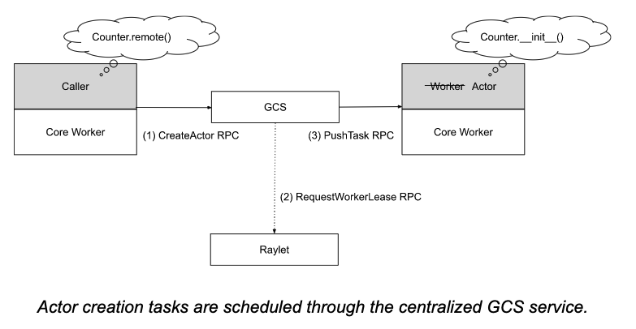

When an actor is created in Python, the creating worker first registers the actor with the GCS. 

* For detached actors, the registration is done in a **synchronized** way to avoid race conditions between actors with the same name. 
* For non-detached actors (the default), registration is **asynchronous** for performance.

After the registration, once all of the input dependencies for an actor creation task are resolved, the creator then sends the task specification to the **GCS service**. The GCS service then **schedules the actor creation task** through the same [distributed scheduling protocol](https://docs.google.com/document/d/1tBw9A4j62ruI5omIJbMxly-la5w4q_TjyJgJL_jN2fI/preview#heading=h.675q3tqxg0i7) that is used for normal tasks, as if the GCS were the actor creation task’s caller.

The original creator of the handle can begin to **submit tasks** on the actor handle or even pass it as an argument to other tasks/actors before the GCS has scheduled the actor creation task. Note that for asynchronous registration, the creator does not pass the actor handle to other tasks/actors until the actor has been registered with the GCS. This is in case the creator dies before registration finishes; by blocking task submission, we can ensure that other workers with a reference to the actor can discover the failure. In this case, task submission is still asynchronous, as the creator simply buffers the remote task until the actor registration is complete.

Once the actor has been created, the GCS notifies any worker that has a handle to the actor via pub-sub. Each handle caches the newly created actor’s run-time metadata (e.g., RPC address). Any pending tasks that were submitted on the actor handle can then be sent to the actor for execution.

Similar to task definitions, actor definitions are downloaded onto workers via the GCS.

### 6.2 Actor task execution

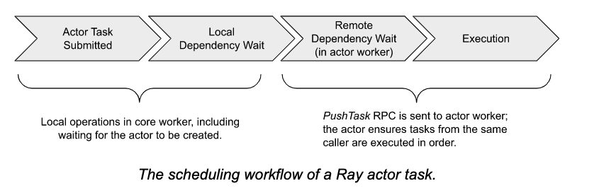

An actor can have an **unlimited number of callers**. An actor handle represents a single caller: it contains the RPC address of the actor to which it refers. The calling worker connects and submits tasks to this address.

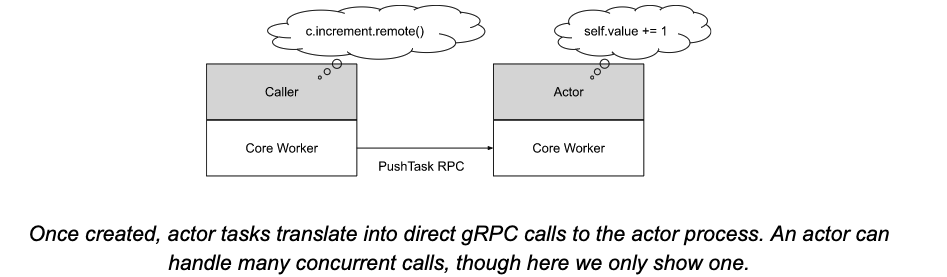

The execution order of submitted tasks is described [here](https://docs.ray.io/en/releases-2.0.0/ray-core/actors/task-orders.html).

### 6.3 Actor death

**Actors may be detached or non-detached**. 

* **Non-detached actors** are the **default and are recommended** for most use cases. They are automatically garbage-collected by Ray when all handles go out of scope or the job exits. 
* **Detached actors’** lifetimes are not tied to their original creator and must be deleted manually by the application once they are no longer needed.

For a non-detached actor, when all pending tasks for the actor have finished and all handles to the actor have gone out of scope (tracked through [reference counting](https://docs.google.com/document/d/1tBw9A4j62ruI5omIJbMxly-la5w4q_TjyJgJL_jN2fI/preview#heading=h.pyvgsp25rn5q)), 

* the original creator of the actor **notifies** the GCS service. The GCS service then **sends a KillActor RPC** to the actor that will cause the actor to exit its process. 
* The GCS also terminates the actor if it detects that the creator has exited (published through the heartbeat table). 
* All pending and subsequent tasks submitted on this actor will then fail with a RayActorError.

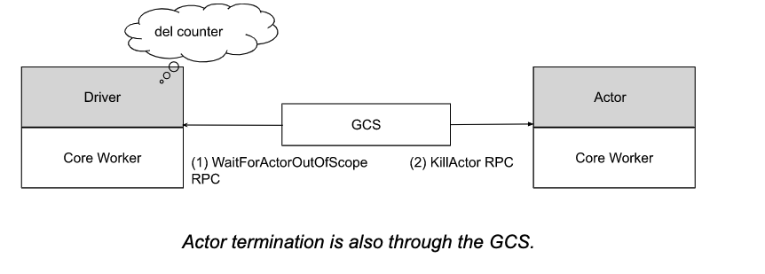

Actors may also unexpectedly crash during their runtime (e.g., from a segfault or calling sys.exit). By default, any task submitted to a crashed actor will fail with a RayActorError, as if the actor exited normally.

Ray also provides an [option](https://docs.ray.io/en/latest/ray-core/actors/fault-tolerance.html#fault-tolerance) (max_restarts) to automatically restart actors, up to a specified number of times. If this option is enabled and the actor’s owner is still alive, the GCS service will attempt to restart a crashed actor by resubmitting its creation task. All clients with handles to the actor will cache any pending tasks to the actor until the actor has been restarted. If the actor is not restartable or has reached the maximum number of restarts, the client will fail all pending tasks.

A second [option](https://docs.ray.io/en/latest/ray-core/actors/fault-tolerance.html#fault-tolerance) (max_task_retries) can be used to enable automatic retry of failed actor tasks after the actor has restarted. This can be useful for idempotent tasks and cases where the user does not require custom handling of a RayActorError.

## 七、Global Control Service

### 7.1 Overview

要点：

1. GCS is Ray's cluster **control plane**. It manages the Ray cluster and serves as a centralized place to coordinate **raylets** and **discover other cluster processes**. The GCS also serves as an **entry point** for external services like the autoscaler and dashboard to **communicate with the Ray cluster**. The GCS is currently **single-threaded** except for **heartbeat checks** and **resource polling**; there are ongoing efforts to scale other operations such as actor management via multithreading.
2. 如果 GCS 出现故障，设计 GCS 的功能将无法工作，它们是：
   1. **Node management**：管理集群节点的添加和删除。并将此信息广播到所有 raylets, 以便 raylets 感知到节点的变化。
   2. **Resource management**：将每个 raylet 的资源可用性广播到整个集群，以确保每个 raylet 的资源使用情况视图得到更新。
   3. **Actor management**：管理 actor 的创建和删除请求。它还会监视 actor 的存活并在 actor 发生故障时重新创建（如果已配置）。
   4. **Placement group management**：协调 ray 集群中 placement group 的创建和删除。
   5. **Metadata store**：提供任何 worker 都能访问的 key-value store。注意：Task 和 object metadata 直接存储在 workers 中
   6. **Worker manager**：处理 Ray 上报的 worker 故障
   7. **Runtime env**：GCS是管理 runtime env package 的地方，包括统计 package 和 garbage collection 的使用情况。
3. GCS 提供了几个 gRPC endpoints 来检索 ray 集群的当前状态，例如 actor、worker 和 节点信息。
4. GCS 可以选择由外部存储系统支持。

### 7.2 Node management

当 raylet 启动时，它会向 GCS 注册，GCS会把 raylet's information 写入 storage。一旦 raylet 注册到 GCS，该事件会广播到所有其它 raylets.

节点注册后，GCS通过定期 health checks 来监控 raylet 的存活。

GCS 拉取 raylet 的资源视图并将其广播到其他 raylet。

如果 raylet 出现故障挂掉，GCS 也会向集群广播 raylet 的死亡。

一旦 raylet 收到信息，它们就会根据需要清理任何相关状态。

raylets 还向 GCS 上报 any local worker 的死亡，以便它可以广播到其他 raylets。这用于清理任何相关的系统状态，例如，killing tasks that were submitted by that worker.

### 7.3 Resource management

 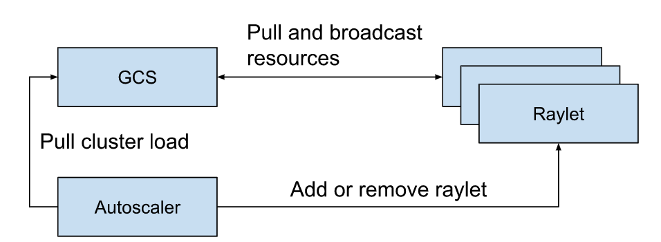

GCS 负责确保 raylets 具有集群中资源使用情况的最新视图。

分布式调度的效率主要依赖这个：如果资源视图不够实时，则 raylet 可能会错误地将任务安排给另一个没有资源来运行任务的 raylet.

默认情况下，GCS 将每 100 毫秒从已注册的 raylet 中拉取资源使用情况。

它还每 100 毫秒向所有 raylet 广播全局资源视图。

GCS 也是 autoscaler 获取当前集群负载的入口点。autoscaler 使用它来从集群中分配或删除节点。

### 7.4 Actor management

GCS在 actor management 中扮演重要作用。

在调度之前，所有actors都需要先在GCS中注册。

GCS也是detached actors 的 owner。

### 7.5 Placement group management

GCS管理placement groups的生命周期。

GCS实现two phase commit protocol 来创建placement groups

### 7.6 Metadata store

GCS 将某些 cluster-level metadata 存储在内部的 key-value store 中。包括

* The cluster‘s dashboard address
* Remote function definitions：The worker assigned to run a task then loads the function definition from the GCS
* Runtime environment data：
* Some Ray libraries also use the GCS to store metadata. For example, Ray Serve stores deployment metadata in the GCS.

### 7.7 Fault tolerance

GCS 是 Ray 集群的关键组件，如果它出现故障，上述所有功能都将无法使用。

在 Ray2.0 中，GCS可以选择从故障中恢复。但在恢复过程中，上述功能将暂时无法使用。

默认情况下，GCS将所有内容存储到内存中，一旦失败就会丢失。

为了使 GCS 具有容错能力，它必须将数据写入持久存储中。Ray 支持 Redis 作为外部存储系统。

为了支持 GCS 容错，GCS 应该由 HA Redis 实例支持。

然后，当GCS重启启动时，它首先从Redis存储中加载信息，包括发生故障时集群中正在运行的所有 Raylets、actor and placement groups

然后，GCS将恢复正常功能，如health check和resource management

因此，GCS恢复时，以下功能将不可用：

* Actor creation/deletion/reconstruction
* Placement group creation/deletion/reconstruction
* Resource management
* New raylets won't be able to register
* New Ray workers won't be able to start

⚠️ 任何正在运行的 Ray tasks 和 actors 都将保持 alive 状态，因为这些组件不需要读取或写入 GCS。

同样，任何存在的objects将继续可用。

## 八、Cluster Management

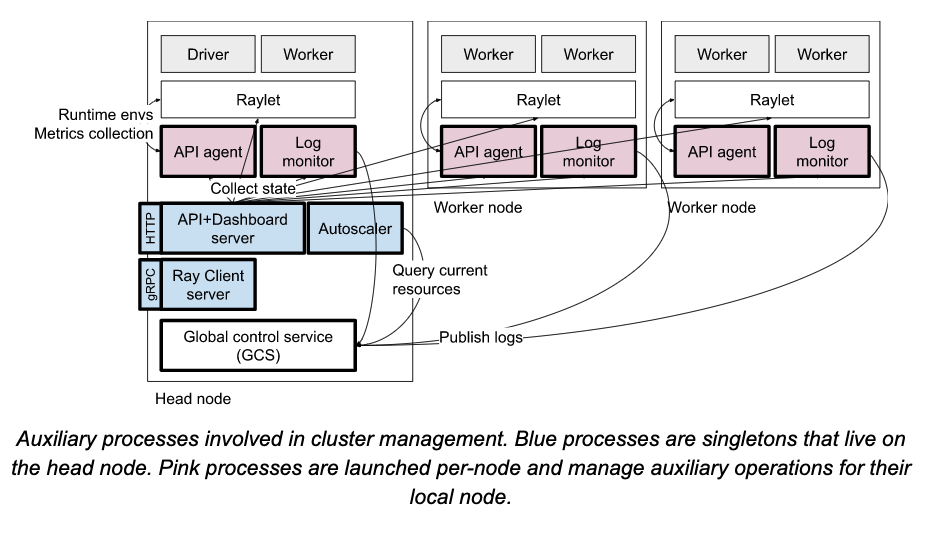

### 8.1 Autoscaler

### 8.2 Job submission

### 8.3 Runtime Environments and Multitenancy

### 8.4 KubeRay

### 8.5 Ray Observability

#### 8.5.1 Ray Dashboard

#### 8.5.2 Log Aggregation

#### 8.5.3 Metrics

#### 8.5.4 Ray State API

## 九、Appendix

### 9.1 Architecture diagram

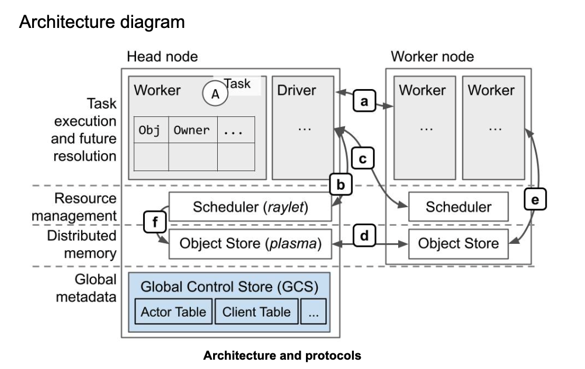

### 9.2 Example of task scheduling and object storage

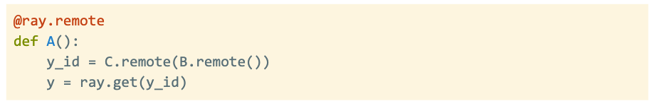

#### 9.2.1 Distributed task scheduling

#### 9.2.2 Task execution

#### 9.2.3 Distributed task scheduling and argument resolution

#### 9.2.4 Task execution and object inlining

#### 9.2.5 Garbage collection